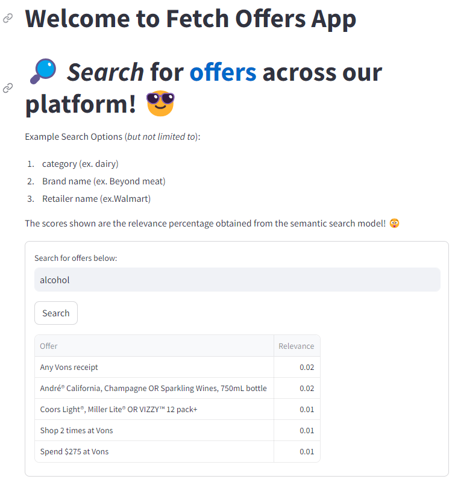
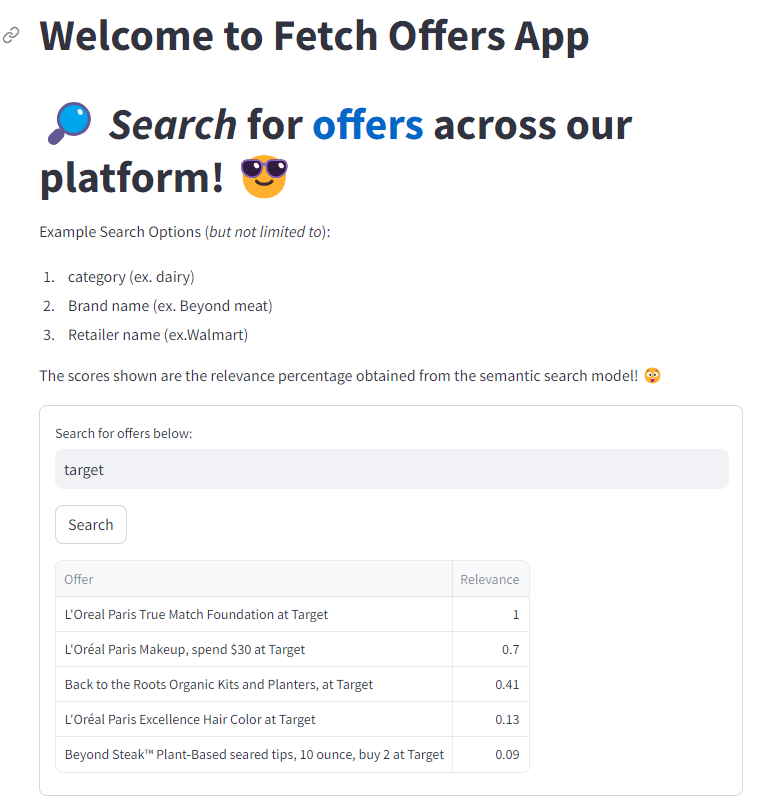
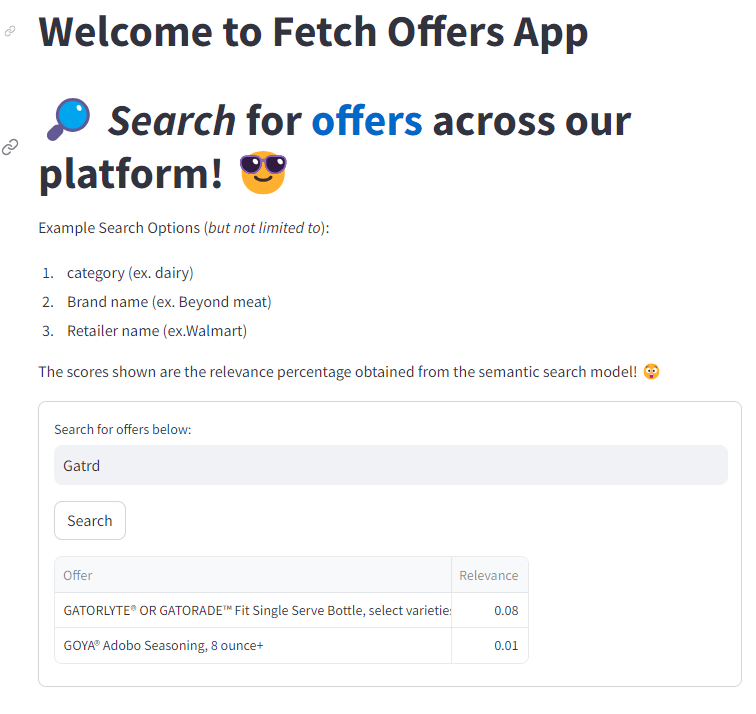

# Coding Exercise - [Intelligent Offer Search based on NLP](https://fetchsearch-shriadke.streamlit.app/)

## Task

This app is focused on the semantic similarity between search texts. The objective is to build a tool that allows users to intelligently search for offers via text input from the user. This program takes as inputs a text sting and returns the best matched offers one can get on Fetch App.

## Demo App Screenshots

Here are some demo screenshots for the app and you can also try it using [this link](https://fetchsearch-shriadke.streamlit.app/)

## Environment

This project is implemented using `Python 3.10`, [`Sentence Transformers`](https://www.sbert.net/index.html) and `PyTorch`. Apart from this 3 different deployment approaches, Streamlit and AWS + Docker, and FastAPI are demonstrated.

## Approach

###### For detailed approach please read [docs/APPROACH.md](https://github.com/shriadke/FetchSearch/blob/master/docs/APPROACH.md)

This type of problem falls under the category of ["Asymmetric Semantic Search"](https://www.sbert.net/examples/applications/semantic-search/README.html#semantic-search) , which in simpler words, takes in a shorter search query and outputs a longer paragraph relevant to the query from a given set of documents. For us, these documents are nothing but the offers needed to be displayed based on user's search query.

I've considered [Retrieve and Re-rank](https://www.sbert.net/examples/applications/retrieve_rerank/README.html) apprach along with removing semantic duplications to improve search results. Currently, the deployed app uses `sentence_transformers` library's pre-trained models for both Bi-encoder and Cross-encoder.

Once again, more details on data pre-processing, embedding generation and possible ways to do so, are detailed [here](https://github.com/shriadke/FetchSearch/blob/master/docs/APPROACH.md).

## File Structure
The folder structure is taken from an open-source project repository and I've been using the same throughtout my professional career for various end-to-end projects. It follows standard best practices to software engineering and MLOps along with the pipeline that can be reused with various cloud platforms. Following arethe generic files and sample description: 

1. [app.py](https://github.com/shriadke/FetchSearch/blob/master/app.py)
	This is the main app file used to build the `streamlit` app implementation of FetchSearch app that uses `predict(text)` method to obtain the list of offers.

2. [app_fast_api.py](https://github.com/shriadke/FetchSearch/blob/master/app_fast_api.py)
	This is the another implementation of FetchSearch API built with the `FastAPI` package. This contains 2 main APIs:
	- `/train`: To run the training pipeline using UI provided by FastAPI.
	- `/predict`: To get the list of offers using the model trained above (This will need to reset the prediction params manually to newly trained model).

3. [main.py](https://github.com/shriadke/FetchSearch/blob/master/main.py)
	This is the Python module that encapsulates all the different methods performed in this pipeline. This module is further used by the API service in the above [app_fast_api.py](https://github.com/shriadke/FetchSearch/blob/master/app_fast_api.py) to orchestrate different stages in deployment. 

4. [src/fetchSearch](https://github.com/shriadke/FetchSearch/blob/master/src/fetchSearch/)
	This is the main project module with all the components, configs, pipelines and other supporting code. This will be generated as source package after [`setup.py`](https://github.com/shriadke/FetchSearch/blob/master/setup.py) is executed.

5. [requirements.txt](https://github.com/shriadke/FetchSearch/blob/master/requirements.txt)
	This file contains the necessary packages required for this project.

6. [Dockerfile](https://github.com/shriadke/FetchSearch/blob/master/Dockerfile)
	This file contains build instructions for API deployment using Docker.

7. [data/](https://github.com/shriadke/FetchSearch/blob/master/data/)
	This folder contains all raw and processed data along with embeddings.

8. [research/](https://github.com/shriadke/FetchSearch/blob/master/research/)
	This folder contains all the research steps performed before incorporating the code into src.
	

## Usage

Apart from the demo above, if you wish to run the project locally, then follow the steps below:

- Clone this repo using `git clone  https://github.com/shriadke/FetchSearch`.

- As described in [File Structure](https://github.com/shriadke/FetchSearch#file-structure), you can verify the files.

- Create an environment using  `conda create -n fetch python=3.10`

- Activate the above environment `conda activate fetch`

- Install all packages `pip install -r requirements.txt`

- To view the streamlit app, run `streamlit run app.py`

- To use FastAPI interface, run `python app_fast_api.py`

The Search App will be deployed on your chosen platform. 

### *Have some fun with it, because I did :wink:!!*

More details on excecution methods for training/deployment can be found in [Usage.md](https://github.com/shriadke/FetchSearch/blob/master/docs/Usage.md)

### Future Work

In future, given more-time and additional data, one can build a stable app that does the task as above with highest accuracy and great details. Following are some areas of improvements in my approach:

1. Better Embeddings

	- The current approach just uses offer text, brand, retailer and categories to build a string for the embeddings.
	- This can be enhanced with other query-related special tokens that helps in better mapping offers to relevant metadata. 

2. Improved Data
	
	- Though I have demonstrated model training, the current model and the data used for training is not ideal.
	- There needs to be thorough research into annotations and forming offer <-> search_query mappings.
	- As mentioned in approach, we can leverage annotation platform and experiment with various types of annotations.
	
3. Improved Model

	- The current model is based off sentence_transformers given architecture and thus limited in multiple ways for the task at hand.
	- Given the resources, and better data, a similar model- with modifications (if any)- can be trained from scratch.
	
4. Improving Search Relevance score

	- Current scores are direct cosine similarity scores given by the nearest neighbor algorithm. Therefore, they represent semantic similarity and not the contextual one.

With all the above improvements/ additional work, this same pipeline can be used to productionize a fully-functioning Offer Search App!!

## Thanks for Visiting!!
	
