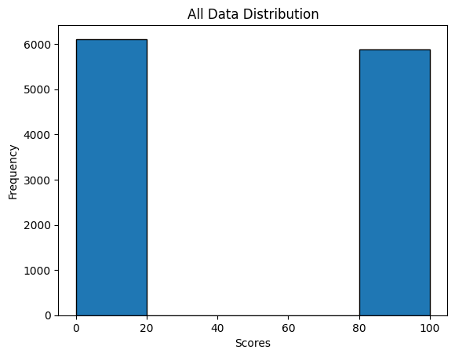
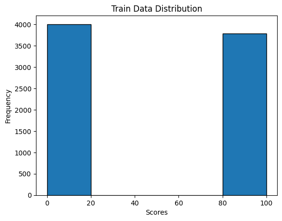
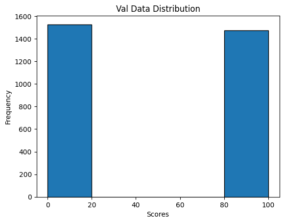
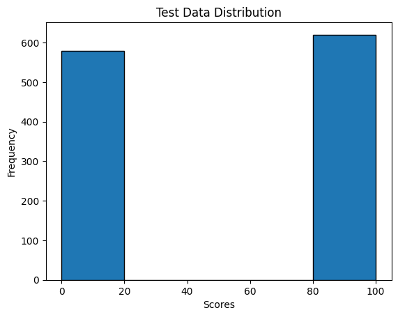

# Approach to the Query Search Problem

## Data Overview:

Here we have data in 3 tables: 

1. [brand_categories.csv]():

    - This table contains the total number of receipts scanned/availed for a specific combination of brands and their corresponding categories.
    - Brand and categories share M:N relation and together used as a composite key in this table.
    - There are a total of 8521 unique brands and 118 unique categories are available from this table.
    - The total receipt column can be used to identify the popularity of the brand or products.

2. [categories.csv]():

    - This table contains the all the 118 available product categories and their parent categories.
    - Each product category is classified into 23 parent categories (parents categories are also listed unde product categories with themselves as parent).
    
3. [offer_retailer.csv]():

    - This table contains the all the offers, corresponding retailers, and/or corresponding brands.
    - There are a total of 376 unique offers for a total of 144 unique brands and 61 unique retailers. This accounts to 384 total combinations.
    - It is to be noted that, out of 144 unique brands, 22 brands are new brands, i.e. brands without information about product categories. This increases the total number of available brands to 8543.

The detailed analysis of data can be seen in the [EDA notebook](https://github.com/shriadke/FetchSearch/blob/master/research/00_00_EDA.ipynb).


## Search Approach

This type of problem falls under the category of ["Asymmetric Semantic Search"](https://www.sbert.net/examples/applications/semantic-search/README.html#semantic-search), which in simpler words, takes in a shorter search query and outputs a longer paragraph relevant to the query. This can be done by several ways as follows:

1. **Information Retrieval**: Implementing the look-up documents into a bag-of-words and finding corresponding words to the query directly. This will be a faster approach but won't be accurate if the query terms are absent from the look-up documents.

2. **Ranking**: Implementing the ranking algorithm based on machine learning such as neural nets, SVM, or simpler similarity metric with word frequency. This will be much slower but may generate accurate results.

3. **Embedding-based Retrieval and Ranking**: This approach uses dense vector embeddings obtained from a larger model (deep neural nets, transformers, etc.) and then ranking the documents with the help of a similarity algorithm (dot product, cosine similaruty, nearest neighbors, etc.). With this hybrid apporach, we can speed up the process for ranking while improving the accuracy in retrieval. ***Therefore, hybrid approach is selected for further experimentation.*** 

## Semantic Search Experimentation:

**The *final app* is using sentence-transformer library's pre-trained model to compute the embeddings. However, I've performed the following experiments to demonstrate a real-world scenario to train such type of model for *"Search-Offers"* data**

1. **Model Selection**:  There are plenty of different model architectures available for embeddings and text-based search. Keeping in mind a few things, such as model training, model size, and performance, [Sentence-Transformers](https://www.sbert.net/index.html) is the best choice of model architecture. It comprises of 2 transformer-based encoders one for each- search query and search document. Thus, it processes each of them separately while retaining the vector embeddings of search document irrespective of the search query and vice versa The vector embeddings can then be independently compared for a similarity measure to obtain the search relevance. Finally, based on the initial research, the SBERT architecture seems to be a perfect fit for the model training.

2. **Data**: To train the above architecture we need the data in a specific format: **\<*offer_text*, *search_query*, *relevance_score*\>**, where, 

    1. ***offer_text*** : can be as simple as the offer to be shown, or in a complex case a expanded string with special tokens such as "\[**OFF**\] offer_text \[**RN**\] retailer_name \[**BN**\] brand_name \[**CN**\] category_name \[**PCN**\] parent_category_name" , etc. This process can be as sophisticated as we want. Given the BERT architecture, the special tokens- \[**OFF**\], \[**RN**\].. - helps the model to segment the input text properly. Therefore, the offers are pre-processed and converted into strings in the above form and will be used as corpus data to look into for a given query.

    2. ***search_query*** : Currently, we do not have any given queries. However, there are several ways to obtain this in real-world scenario:
        
        - A simple approach can be to iterate through the list of offers, brands, and retailers. Then, for each offer, create search queries based on relevant terms, such as brand, retailer, and category. These can be simple terms such as "direct_brand_name", "category_parent_category", "offer_verb_amount", etc.. This will lead to a lengthy approach and may miss a lot of real-world user search queries. ***A combination of this is used in my approach***.
        
        - More data-driven approach will be to use database history to mine the successful conversions (selection or tapping, applied, redeemed, etc) of offers with the corresponding user search query. This will give us positive examples (as well as negative to some extent). For negative pairs, one can employ self-adversarial re-weighting. One real-world example of this approach can be found in [Instacart](https://tech.instacart.com/how-instacart-uses-embeddings-to-improve-search-relevance-e569839c3c36)'s [user embeddings](https://arxiv.org/abs/2209.05555) algorithm to tackle similar search problem.

        - A more innovative approach- *that I've taken in the past organization*- will be to use Generative AI to generate input pairs/search_queries given the set of offer and metadata. Even for the large amount of data, this can be easily done at less expenses using OpenAI's developer API's. An example prompt that I used for ChatGPT is given below, however with an actual GPT4 subscription, one can create more sophisticated prompts and upload bulk data to generate such training samples at cheaper cost.

            <details>
            <summary>
                Sample Prompt
            </summary>
            
            ```                   
                Act as an industry expert Data annotator working for an e-commerce platform that shows users available offers on their platform based on user search query. Your task is to generate user search query samples for the given offer text and output a dataset of sentence pairs in the format <search_query, offer, relevance_score>. The relevance_score is a score between 0 and 100 that you will have to assign to each pair based on the semantic similarity of the pair.

                I will provide an example of task in hand and by learning from that, you will have to generate the further dataset. The input file will contain offer, brand and retailer. There will be a separate list of brands and categories as well. You have to understand relations between brands, categories, retailers, and the offers to generater the search_query terms.

                Example:
                input: 
                {
                    "all_brands" : ["Back to the Roots", "Huggies", "Brita", "Sams clubs"],
                    "all_categories" : ["Food & Beverages", "Baby products", "Home decor"],
                    "offers" : [
                                { 
                                    "offer": "Back to the Roots, select varieties, at Walmart",
                                    "brand": "Back to the Roots",
                                    "retailer": "Walmart"
                                }
                            ]
                }

                output: 
                {
                    "pairs" : [
                                {"search_query" : "walmart",
                                "offer" : "Back to the Roots, select varieties, at Walmart",
                                "relevance_score" : 100},
                                {"search_query" : "Back to the roots",
                                "offer" : "Back to the Roots, select varieties, at Walmart",
                                "relevance_score" : 100},
                                {"search_query" : "variety",
                                "offer" : "Back to the Roots, select varieties, at Walmart",
                                "relevance_score" : 100},
                                {"search_query" : "gardening",
                                "offer" : "Back to the Roots, select varieties, at Walmart",
                                "relevance_score" : 75},
                                {"search_query" : "health",
                                "offer" : "Back to the Roots, select varieties, at Walmart",
                                "relevance_score" : 0},
                            ]
                }

                Learning from above, generate the user search queries for following types of offers:
                "offers":
                    {
                        Spend $50 on a Full-Priced new Club Membership,SAMS CLUB,SAMS CLUB
                        "Beyond Meat® Plant-Based products, spend $25",,BEYOND MEAT
                        Good Humor Viennetta Frozen Vanilla Cake,,GOOD HUMOR
                        "Butterball, select varieties, spend $10 at Dillons Food Store",DILLONS FOOD STORE,BUTTERBALL
                    }                                
            ```

            </details>      
                

            <details><summary>With that prompt, I got following response with relevant search queries:</summary>
            
            ```
                Certainly, here are 20 examples of user search queries generated for the given offers, along with approximate relevance scores:

                Offer: "Spend $50 on a Full-Priced new Club Membership"

                Search Query: "SAMS CLUB Membership"
                Relevance Score: 90 (Assuming high relevance as the search query includes both the brand and the nature of the offer)
                Offer: "Beyond Meat® Plant-Based products, spend $25"

                Search Query: "Beyond Meat products"
                Relevance Score: 85 (Assuming high relevance as the search query matches the product description)
                Offer: "Good Humor Viennetta Frozen Vanilla Cake"

                Search Query: "Frozen Vanilla Cake"
                Relevance Score: 75 (Assuming moderate relevance as the search query matches the product description)
                Offer: "Butterball, select varieties, spend $10 at Dillons Food Store"

                Search Query: "Butterball Dillons Food Store"
                Relevance Score: 80 (Assuming moderate relevance as the search query contains both the brand and retailer)
                Offer: "Spend $20 at Zaxby's"

                Search Query: "Zaxby's restaurant"
                Relevance Score: 85 (Assuming high relevance as the search query includes the restaurant name)
                Offer: "Egglife Egg White Wraps at Aldi"

                Search Query: "Aldi Egg White Wraps"
                Relevance Score: 90 (Assuming high relevance as the search query includes both the retailer and product)
                Offer: "Spend $10 at Subway"

                Search Query: "Subway restaurant"
                Relevance Score: 85 (Assuming high relevance as the search query includes the restaurant name)
                Offer: "GATORADE® Fast Twitch®, 12-ounce 12 pack, at Amazon Storefront*"

                Search Query: "GATORADE Fast Twitch Amazon"
                Relevance Score: 90 (Assuming high relevance as the search query includes both the brand and retailer)
                Offer: "Arnold, Brownberry, Oroweat® Small Slice bread, at Walmart"

                Search Query: "Walmart bread"
                Relevance Score: 75 (Assuming moderate relevance as the search query includes the retailer)
                Offer: "Barilla® Pesto Sauce"

                Search Query: "Barilla Pesto Sauce"
                Relevance Score: 95 (Assuming high relevance as the search query matches the product and brand)
                Offer: "Any General Mills™ products, buy 2, Good Rewards Members Only"

                Search Query: "General Mills products"
                Relevance Score: 85 (Assuming high relevance as the search query includes the brand)
                Offer: "Emmy's Organics® Cookies OR Brownie Snaps"

                Search Query: "Emmy's Organics Cookies"
                Relevance Score: 90 (Assuming high relevance as the search query matches the brand and product)
                Offer: "Dr Pepper®, Regular OR Zero Sugar Strawberries and Cream 12 pack, at select retailers"

                Search Query: "Dr Pepper Strawberries and Cream"
                Relevance Score: 85 (Assuming high relevance as the search query matches the product)
                Offer: " Spend $10 on select items, get $5 off your order at Kroger"

                Search Query: "Kroger select items"
                Relevance Score: 80 (Assuming moderate relevance as the search query includes the retailer and offer details)
                Offer: " Spend $15 on Coca-Cola products, get $5 off your order at Safeway"

                Search Query: "Safeway Coca-Cola offer"
                Relevance Score: 85 (Assuming high relevance as the search query includes the retailer and product)
                Offer: " Spend $30 on cleaning supplies, get 20% off at Target"

                Search Query: "Target cleaning supplies discount"
                Relevance Score: 90 (Assuming high relevance as the search query includes the retailer and offer details)
                Offer: "Spend $25 on pet food, get a free pet toy at PetSmart"

                Search Query: "PetSmart pet food offer"
                Relevance Score: 90 (Assuming high relevance as the search query includes the retailer and offer details)
                Offer: "Buy 2 pairs of shoes, get 50% off the third pair at Foot Locker"

                Search Query: "Foot Locker shoe offer"
                Relevance Score: 90 (Assuming high relevance as the search query includes the retailer and offer details)
                Offer: "Spend $50 on electronics, get a $10 gift card at Best Buy"

                Search Query: "Best Buy electronics offer"
                Relevance Score: 90 (Assuming high relevance as the search query includes the retailer and offer details)
                Offer: "Buy one get one free on select clothing items at Macy's"

                Search Query: "Macy's clothing BOGO"
                Relevance Score: 90 (Assuming high relevance as the search query includes the retailer and offer details)
                These relevance scores are approximate and can vary based on user behavior and preferences. Actual relevance scores would ideally be determined through user feedback and analysis.
            ```

            </details>

            The results shown above contains a lot of wrong data, but this is just to demonstrate this strategy as the example I gave was a single-shot learning, it can be improved by providing more relevant examples.

    3. ***relevance_score*** : This is the groundtruth label which will be used to train our model. With the current architecture, cosine-similarity will be used and hence the score needs to be mapped from `0 to 100` into `0 to 1`. 

    I used a combination of this simple approach to produced ~12k synthetic data rows with multiple queries. These are then split into Train, Val and Test dataset to produce following distributions.
    
    <details><summary>Data Distribution (click to expand)</summary>
    
    

    
    </details>
    
    The details of this data generation can be found in the [EDA notebook](https://github.com/shriadke/FetchSearch/blob/master/research/00_00_EDA.ipynb). The data can be found at huggingface hub: [`shriadke/FetchSearch`](https://huggingface.co/datasets/shriadke/FetchSearch)

3. **Model Training**: To train the SBERT model using above data, standard transformers-training procedure is implemented in [Model Research notebook](https://github.com/shriadke/FetchSearch/blob/master/research/00_01_model_research.ipynb). The base model used for Bi-encoder is `msmarco-distilbert-base-v4` with special tokens listed above. The notebook demonstrates trainng on a small set of test data, but it can be changed in the future.

The trained model was saved and pushed to huggingface hub under [`shriadke/fetch-search-msmarco-distilbert-base-v4`](https://huggingface.co/shriadke/fetch-search-msmarco-distilbert-base-v4).

4. **Cross-encoder for re-ranking and filtering**: My approach considers cross encoder for 2 types of post-processing steps on `top_k` results generated by Bi-encoder model:
     1. *Filtering Duplicate Offers*: After obtaining 10 or 20 top offers, a cross encoder is used to verify the uniqueness between the offers and if they are almost same, one of them will be dropped. This helps keeping results clean.
    
     2. *Re-Ranking Offers*: After filtering, remaining offers will be re-ranked with the query string to find most relevant offers at the top.

    I have not trained a separate cross-encoder, but it can be done with the appropriate training data.


## Generating Embeddings for given set of offers

Refer [Generate Embedding notebook](https://github.com/shriadke/FetchSearch/blob/master/research/00_01_generate_embeddings.ipynb) to generate the embeddings of the given offers data. This file will combine the 3 input data files and create a processed offer text in the format discussed above. Those embeddings can be then processed by trained Bi-encoder model (for simplicity, I've used the pre-trained msmacro model). Further, these [embeddings](https://github.com/shriadke/FetchSearch/blob/master/data/processed/embeddings/msmacro_sent_embeddings.pkl) are stored to use while predicting the offers through the API. These can be changed by changing config path.