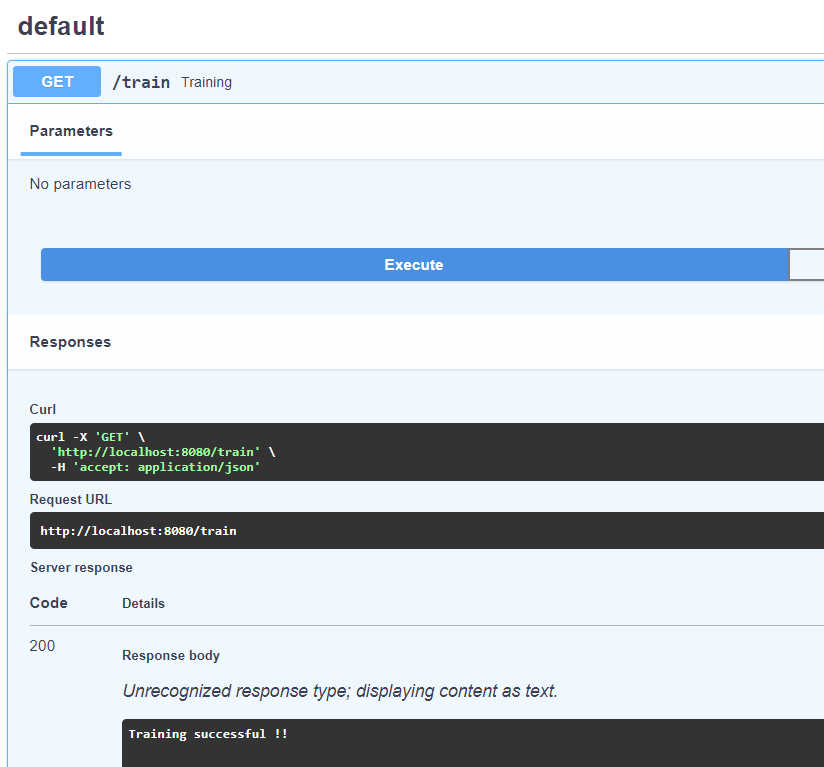
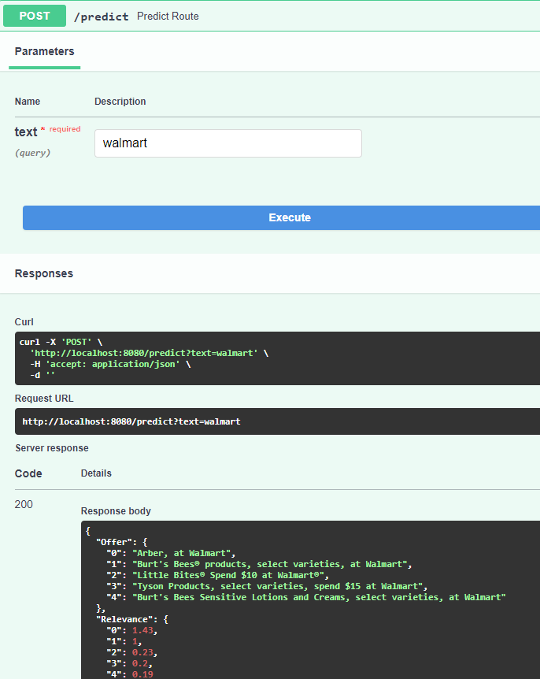

# Using Trainng Pipeline

## Command Line

Easiest way to perform the training pipeline is to run [`main.py`](https://github.com/shriadke/FetchSearch/blob/master/main.py). Make sure the data is in proper location for ingestion.

## Using FastAPI

After running `app_fast_api.py`, select the `/train` route in the UI opened in localhost and execute it. This should perform training pipeline on the local device.

## Using AWS deployed App

This is completely done with the help of CI/CD pipelines using GitHub Actions and AWS EC2 instance. The app is integreted with the remotely hosted server and whenver any code changes are pushed to master. The code is taken from the parent open-source repo and used the same format for the development and QA environments for my other works.

Currently, the instance is stopped and the link may not work. I'll be continuously adding the changes and the pipeline will be improved.
